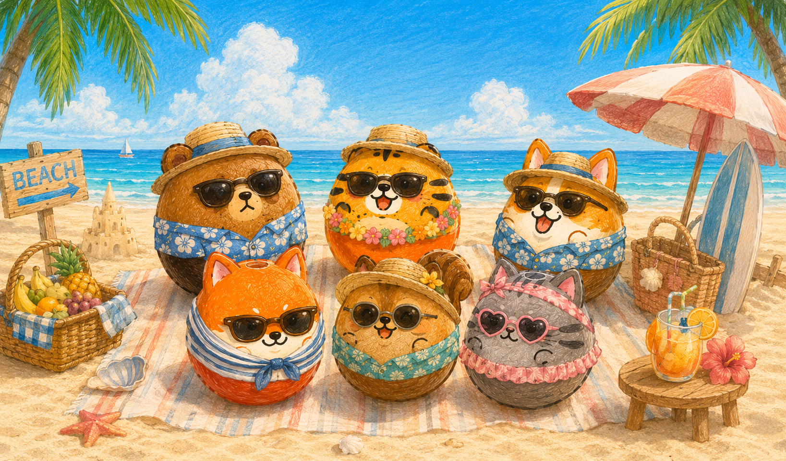
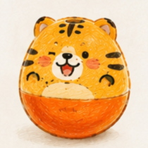
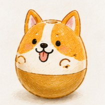

# SKN26 Final 1st Team — 육뚝이들

> **3차 PICKLE** · **4차 LG Home** · **Final HumouR**까지 함께 완주한 6인 팀입니다.

  

<strong>"오늘도 데굴데굴 생존 중"</strong>

---

## 👥 Team

<table width="100%" cellpadding="14" cellspacing="0" style="border-collapse: collapse; table-layout: fixed;">
  <tr>
    <td align="center" valign="middle" width="16.67%" style="line-height: 1.6;">
       
      <b>박기은</b>
    </td>
    <td align="center" valign="middle" width="16.67%" style="line-height: 1.6;">
       
      <b>서민혁</b>
    </td>
    <td align="center" valign="middle" width="16.67%" style="line-height: 1.6;">
       
      <b>유동현</b>
    </td>
    <td align="center" valign="middle" width="16.67%" style="line-height: 1.6;">
       
      <b>윤정연</b>
    </td>
    <td align="center" valign="middle" width="16.67%" style="line-height: 1.6;">
       
      <b>이레</b>
    </td>
    <td align="center" valign="middle" width="16.67%" style="line-height: 1.6;">
       
      <b>정영일</b>
    </td>
  </tr>
  <tr>
    <td align="center" valign="middle" style="line-height: 1.6;"></td>
    <td align="center" valign="middle" style="line-height: 1.6;"></td>
    <td align="center" valign="middle" style="line-height: 1.6;"></td>
    <td align="center" valign="middle" style="line-height: 1.6;"></td>
    <td align="center" valign="middle" style="line-height: 1.6;"></td>
    <td align="center" valign="middle" style="line-height: 1.6;"></td>
  </tr>
</table>

---

## About Us

**육뚝이들**은 박기은, 서민혁, 유동현, 윤정연, 이레, 정영일로 구성된 6인 팀입니다. 같은 구성으로 3차 프로젝트부터 파이널 프로젝트까지 이어오며, 데이터 수집·정제부터 AI 파이프라인, 웹 서비스, 품질 검증과 배포까지 제품의 전 과정을 함께 만들었습니다.

우리는 단순한 LLM 데모보다 **근거를 확인할 수 있고, 실제 사용 흐름 안에서 안정적으로 동작하는 AI 서비스**를 지향합니다.

## Projects We Built

같은 6명이 세 프로젝트를 연속으로 수행하며, 좁은 도메인의 RAG 챗봇에서 풀스택 AI 서비스와 운영·배포까지 단계적으로 범위를 넓혔습니다.

### 3차 — PICKLE

**PICKLE**은 신대방삼거리 식당 데이터를 기반으로 사용자의 분위기·메뉴·상황 조건에 맞는 식당을 추천하는 맛집 챗봇입니다.

- 식당 100곳과 메뉴·리뷰 데이터를 수집·정제해 SQLite와 임베딩 검색 구조로 구축했습니다.
- LangGraph가 질문을 조건 탐색과 엔티티 검색으로 나누고, 실제 DB에 있는 식당과 리뷰만 근거로 답변하도록 설계했습니다.
- Streamlit과 Kakao Map을 연결해 추천 결과를 지도와 식당 상세 정보로 확인할 수 있게 했습니다.

[**PICKLE 자세히 보기 →**](https://github.com/SKN26-3rd-3rd/3rd_project#readme)

### 4차 — LG Home

**LG Home**은 LG 가전 상품 검색과 사용 설명서 기반 질의응답을 결합한 AI 추천·상담 웹 서비스입니다.

- TV·냉장고·세탁기·에어컨·청소기 데이터를 수집해 카테고리별 상품 DB와 검색 필터를 구성했습니다.
- LangGraph 에이전트가 사용자 요구를 구조화하고, Django ORM 상품 검색과 Pinecone 사용 설명서 RAG를 결합해 답변합니다.
- Streamlit 프로토타입에서 Django 기반 풀스택 서비스로 확장하며 계정, 찜, 대화 기록과 기능별 문서 체계를 갖췄습니다.

[**LG Home 자세히 보기 →**](https://github.com/SKN26-4th-1st/4th_project#readme)

### Final — HumouR

> **근거를 구조화하고, 판단은 사람에게 남기는 AI HR 채용 보조 서비스**

**HumouR**는 HR 전담 인력이 부족한 조직이 회사 정보, 채용 공고(JD), 평가 체크리스트, 지원서, 분석 리포트와 면접 질문을 한곳에서 관리하도록 돕습니다. AI가 합격 여부를 대신 결정하지 않고, 채용 담당자가 원문 근거와 추가 확인 질문을 바탕으로 일관된 판단을 내릴 수 있게 지원합니다.

- **완결된 채용 흐름**: 회사 설정 → JD 작성 → 평가 체크리스트 → 지원서 → AI 분석 → 리포트·면접 질문 → 제한 공유
- **다단계 AI 분석**: LangGraph 기반 개인정보 마스킹·STAR 구조화·적합도 판정·면접 질문·리포트 생성과 품질 피드백 루프
- **자체 sLLM**: EXAONE 3.5 2.4B 기반 마스킹·STAR LoRA 모델과 RunPod Serverless 추론
- **운영형 웹 서비스**: React·TypeScript 프론트엔드, Django·Celery 백엔드, 세션·CSRF·API Key 권한, AWS 배포

[**HumouR 자세히 보기 →**](https://github.com/SKN26-Final-1st/Final_project#readme)

---

## Repositories

| 프로젝트 | 조직 | 저장소 |
| --- | --- | --- |
| PICKLE | [SKN26-3rd-3rd](https://github.com/SKN26-3rd-3rd) | [3rd_project](https://github.com/SKN26-3rd-3rd/3rd_project) |
| LG Home | [SKN26-4th-1st](https://github.com/SKN26-4th-1st) | [4th_project](https://github.com/SKN26-4th-1st/4th_project) |
| HumouR | [SKN26-Final-1st](https://github.com/SKN26-Final-1st) | [Final_project](https://github.com/SKN26-Final-1st/Final_project) |

---

  <strong>데이터에서 서비스까지, 근거 있는 AI를 끝까지 구현합니다.</strong>

